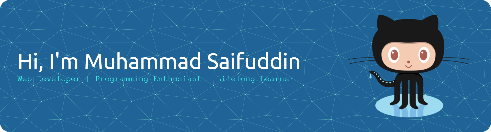

<!-- https://github.com/leviarista/github-profile-header-generator -->

## 👋 Hi, I'm Muhammad Saifuddin (sarambaDev)

### 👩‍💻 About Me:

Hi, I'm Muhammad Saifuddin — an Islamic Education Management student with a deep passion for technology and programming. Beyond my academic focus, I actively develop skills in software, web, and data science to create meaningful digital solutions. My mission is to become a skilled programmer who inspires innovation and contributes positively to society.

### 🌐 Socials:

  

<!-- ### 🛠️ Tools:

    
  
  
  

 -->

### 🖥️ Operating System:

### 🧰 Tools & Tech Stack:

 

See more

        

### 📊 GitHub Stats:

